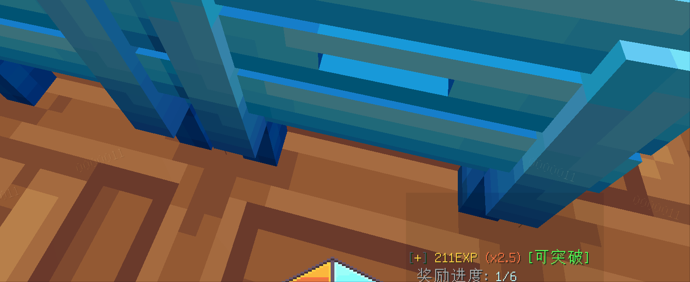

# JustFishing

> 休闲钓鱼系统




#### API
```yaml
`JustFishAPI`

# 获取玩家是否在钓鱼
inFishing(Player player);
inFishing(UUID uuid);
```

#### Event
```yaml
# 玩家坐下椅子事件
FishSeatEnterEvent.Pre
FishSeatEnterEvent.Post
# 玩家离开椅子事件
FishSeatLeaveEvent
# 玩家鱼竿上鱼饵消耗殆尽事件
FishBaitUseUpEvent
# 玩家成功钓鱼事件
FishCaughtEvent
# 玩家空军事件
FishAirForceEvent
```